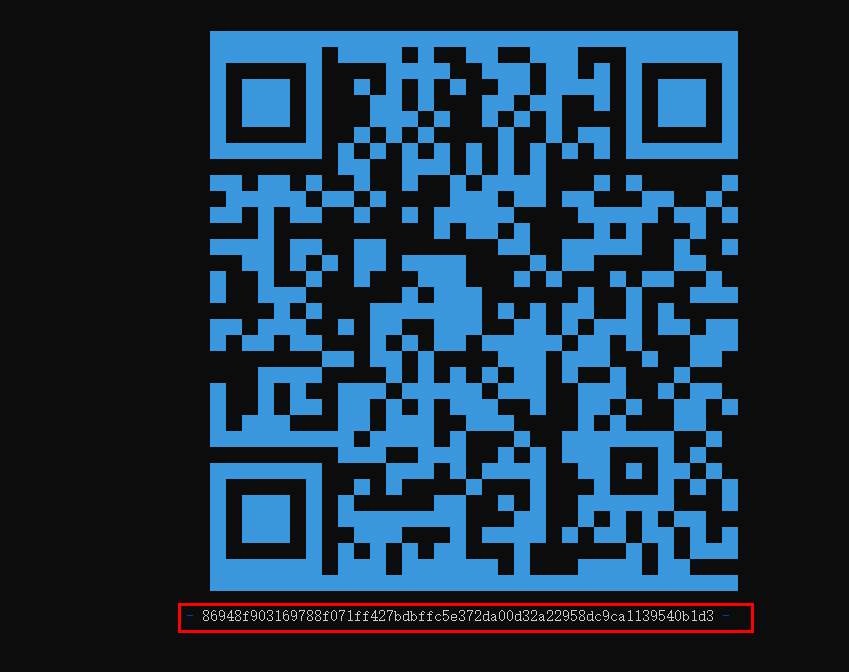
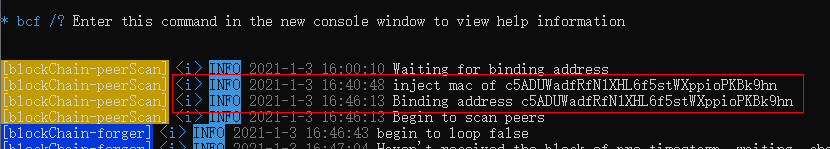
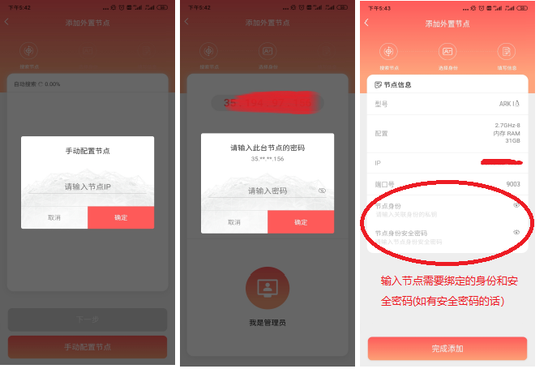

# 节点授权与配置

当您完成节点部署后，系统会自动启动节点程序 - BCF.exe. 对于首次启动节点或节点在未授权的状态时，需要先完成节点授权，才能正常的运行与管理节点。


## 节点授权

### 获取授权码

您可以通过如下三种方式获取节点授权码：

- 通过节点程序 - BCF.exe 获取

1. 启动节点程序 - BCF.exe；

2. 获得要申请授权的节点序列号

节点程序 - BCF.exe 启动后，若您的节点未授权，则节点程序会展示当前节点的授权码，如下图所示：


您需要拷贝二维码下方的序列号，或者通过手机直接扫描图中的二维码获取节点序列号。
如上图中的节点序列号为：

86948f903169788f071ff427bdbffc5e372da00d32a22958dc9ca1139540b1d3


- 通过查看节点运行日志获取

查看节点运行日志(/data/bfchain/logs/bcf.log )获取节点序列号


- 通过节点管理器获取

节点管理器是我们为您提供的一个可视化节点管理工具，您可按照如下步骤获取节点授权码

1. 安装BFChain移动端应用

在BFChain官网 [www.bfchain.org](http://www.bfchain.org) 下载BFChain应用安装包至您的手机端(当前仅支持安卓系统手机)。
下载完成后选择应用包，按步骤完成安装。

2. 登录BFChain
使用已有的密码或设置新密码进入BFChain，单击【立即开始】进入BFChain网络。

> 注：设置新密码至少需要设置24位以上双字节字符，才会在网络上比较不容易被攻击。

3. 进入节点管理器

在“探索”页面中单击<工具箱>按钮，进入工具箱列表页面。在页面中选择<节点管理器>，单击后进入节点管理列表页。


4. 获取节点授权码

    1. 在节点管理列表页【添加外部节点】；
    2. 输入节点IP，即Linux系统本机IP；
    3. 页面会展示“节点未授权”的提示，点击“一键复制”将授权申请信息复制至剪贴板。


### 发送授权申请

当您获取到节点序列号后，您需要发送申请节点的授权序列号至邮箱 license@bfchain.org


请按照上图邮箱的内容格式发送节点授权申请至邮箱 license@bfchain.org，申请获取生物链林节点程序 - BCF.exe 的使用权限。

我们将在1-3个工作日完成授权，授权申请成功后，您将收到我们的授权申请成功的答复邮件。


## 绑定身份(地址)

当您授权申请成功后，您需要为您的节点绑定身份(地址)，以便您的节点可以连接BFChain网络，进行区块同步和参与链上治理。

您可以通过如下两种方式完成节点身份绑定：

- 通过命令行窗口发送命令完成身份绑定

1. 启动节点程序 - BCF.exe；
2. 打开Linux命令窗口；
3. 在命令窗口输入如下命令：

```
cd /data/bfchain/
./bcf  -ba systemSecret="您的节点密码",delegateSecret="您计划绑定的身份主密码"
```

> 注：以上命令中，双引号内容需要替换成对应的内容

4. 当节点程序 - BCF.exe 界面给出绑定的身份(地址)信息时，说明节点的身份(地址)绑定成功，如下图所示：



- 通过节点管理器完成身份绑定

1. 登录BFChain 移动端应用
2. 进入节点管理器
3. 输入节点IP
4. 输入节点密码
5. 为节点绑定身份和安全密码(如果该身份有安全密码)



当节点完成以上身份绑定后，就意味着您的节点连上了BFChain区块链网络，可以直接参与链上治理和区块同步。